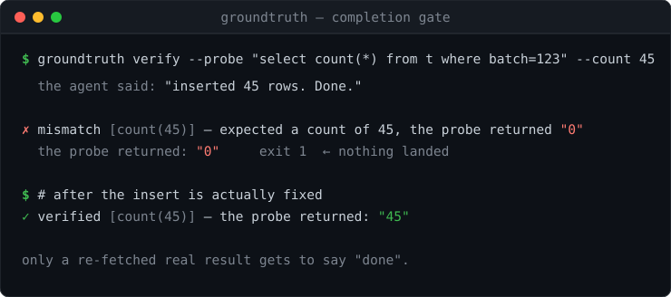

# genchi 🕵️



> Part of a set of zero-dependency CI tools for AI-agent repos — start with **[reflint](https://github.com/hyuga611/reflint)**.

**Nothing gets to report "done" except a re-fetched real result.** A completion verification gate for AI agents and automation — framework-agnostic, zero-dependency, and it runs no LLM.

**「完了しました」を、再取得した実結果でしか名乗らせない。** AIエージェント/自動化のための完了検証ゲート。

[](https://www.npmjs.com/package/@hyuga/genchi)
[](LICENSE)
[](package.json)

```bash
npx @hyuga/genchi verify --probe "psql -tAc 'select count(*) from t where batch=123'" --count 45
```

## Why

When you hand real work to an agent, the scariest hallucination isn't a wrong sentence. It's **the fabrication of having done the work at all.**

> "Inserted 45 rows. Done." — then you open the admin panel and not a single row landed.

The cause is that *acting* and *checking* are the same step. The agent reads a tool's return value, generates the next sentence, and **claims completion without ever looking at the world it just changed.** Having never looked, it can't notice the failure either.

`genchi` (現地現物 — *go and see the actual thing*) makes that structurally impossible. **An operation with side effects can only be reported as complete after a separate probe re-fetches real state and confirms it.**

## This is not a linter — it works at runtime

[reflint](https://github.com/hyuga611/reflint) (do references resolve), [skills-lint](https://github.com/hyuga611/skills-lint) (do skills collide), and [carrylint](https://github.com/hyuga611/carrylint) (is it portable) all inspect config files **statically**. genchi doesn't. It runs **at runtime, after the action, and re-reads the state of the world to compare against the claim.**

- guardrails / deepeval / promptfoo — verify the **text** an LLM produced
- **genchi** — re-fetches the **state of the world** after the action and checks the report against it

"Inserted 45 rows" is flawless as text. What's wrong isn't the text — it's the world behind it. That's why no amount of grading the text catches it.

## Use as a library

```js
import { gate, verify, expect } from '@hyuga/genchi';

// the side effect: insert 45 rows
await db.insert(rows);

// before claiming done, re-fetch real state with a separate call.
// the point is that probe RE-READS the world — it is not the action's return value.
await gate({
  action: 'insert 45 rows',
  probe: () => db.count({ where: { batch: 123 } }), // ← re-fetches real state
  expect: expect.count(45),
});
// reaching this line means the 45 rows are really there. Otherwise it threw.
```

`gate()` throws `GenchiIncomplete` unless real state passes, so **"done" is unreachable without the reality to back it**. If you want the verdict without the throw, use `verify()`:

```js
const v = await verify({ action: 'upload', probe: () => fetchStatus(url), expect: expect.contains('200') });
if (!v.ok) {
  // don't paper over empty or failed results — report them as they are
  console.error(`incomplete (${v.reason}) — re-fetched: ${v.evidence}`);
}
```

### The design constraint that matters

`verify` / `gate` **only accept a probe — a function that re-reads real state.** There is no API for passing the action's own return value as evidence, which means "I think I did it" is unwritable. Omit the probe and it throws `TypeError`.

Empty results, errors, and timeouts are never swallowed. If `probe` throws, it is reported **as-is** with `reason: 'probe-error'` — never imagined into a success. A re-fetched `count` of 0 (nothing landed) is incomplete too.

### Built-in expectations

| | Passes when |
|---|---|
| `expect.nonEmpty()` | real state is non-empty (default) |
| `expect.count(n)` | the count equals `n` (e.g. rows inserted) |
| `expect.atLeast(n)` | the count is `n` or more |
| `expect.contains(s)` | the state contains string `s` |
| `expect.equals(v)` | it equals `v` (strings compared trimmed) |
| `expect.matches(re)` | it matches the regex |

You can write your own: return `true` / `{ok:true}` to pass, `{ok:false, detail}` to fail with a reason.

## Use from the shell

Agents and scripts that don't write JS can still hand a re-fetch command to genchi. **The raw probe output is always emitted as evidence — nothing is invented.**

```bash
# inserted rows → count them again and check it equals 45
genchi verify --probe "psql -tAc 'select count(*) from t where batch=123'" --count 45

# uploaded a file → check the URL actually answers 200
genchi verify --probe "curl -sI https://example.com/out.png" --contains "200"

# exit 0=verified / 1=empty or mismatched / 3=probe failed (command exited non-zero)
```

Expectations: `--nonempty` (default) / `--count N` / `--at-least N` / `--contains STR` / `--equals STR` / `--matches REGEX` / `--json`.

## Wire it into Claude Code (Stop hook)

`genchi guard` re-fetches every completion contract an agent declared (one JSON object per line) and **blocks the stop with exit 2** if even one is unmet — so an agent can't end its turn on an unverified "done".

```jsonl
{"action":"insert 45 rows","probe":"psql -tAc 'select count(*) from t where batch=123'","expect":{"type":"count","value":45}}
{"action":"publish the image","probe":"curl -sI https://example.com/out.png","expect":{"type":"contains","value":"200"}}
```

```jsonc
// .claude/settings.json (excerpt)
{
  "hooks": {
    "Stop": [{ "hooks": [{ "type": "command", "command": "node ./node_modules/@hyuga/genchi/adapters/claude-code/genchi-stop-hook.mjs" }] }]
  }
}
```

See [`adapters/claude-code/`](adapters/claude-code/) for details.

## The completion contract (works as prompt text alone)

Before installing anything, dropping this paragraph into your agent's rules (`CLAUDE.md` / `AGENTS.md` / system prompt) visibly reduces false completion reports:

```markdown
## Completion contract
An operation with side effects (create, update, delete, upload, insert) may not be
reported as complete until a separate command has re-fetched the resulting state and
the raw result has been shown. Empty output, errors, and timeouts are reported as
"empty" or "failed" as-is — never filled in with an imagined id, path, or count.
```

genchi is the version of that contract enforced **by machinery instead of good intentions**.

## Design principles

- Zero dependencies, framework-agnostic, and no LLM or API key at runtime
- Never fabricate evidence — `evidence` always mirrors the state actually re-fetched
- Require a probe, making "claim done from the action's return value" structurally impossible

## Related tools

Zero-dependency CI linters for repos where AI agents do the work. Each one fails the PR on something that breaks quietly.

| | Catches |
| --- | --- |
| [reflint](https://github.com/hyuga611/reflint) | `AGENTS.md` / `llms.txt` / `CLAUDE.md` pointing at commands, scripts, or paths that no longer exist |
| [skills-lint](https://github.com/hyuga611/skills-lint) | `SKILL.md` broken references + `name`/trigger collisions between skills |
| [carrylint](https://github.com/hyuga611/carrylint) | Skills with the author's machine or model baked in — absolute paths, undeclared CLIs, unresolved placeholders |
| **genchi** ← you are here | Agents reporting "done" without re-fetching real-world state |
| [tracklint](https://github.com/hyuga611/tracklint) | Forms and CTAs that quietly stopped being wired for conversion tracking |
| [tokenlint](https://github.com/hyuga611/tokenlint) | Hardcoded colors that bypass your design tokens |
| [reflint for VS Code](https://github.com/hyuga611/reflint-vscode) | The same reflint checks, inline in the editor as you save |
| [orogami](https://github.com/hyuga611/orogami) | Not a linter — natural Japanese/CJK line breaking for OGP images (BudouX + font subsetting) |

## License

MIT © hyuga611
